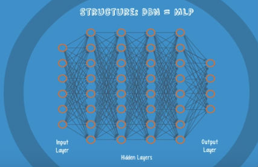

# Notes for Simplified videos

## 1. Intro
## 2. What is a Neural Network
* Neuron networks.
* Classification: categorizing objects, logregression, svm, naivebayes
* ANN structure: input layer, hidden layers, output layer
    * small classifiers
* Multi-layer perceptron (MLP)
* Weight, bias, activation
* Improve accuracy -> training. compare calc output with real. cost=|output-real|. tweak the weights

## 3. 3 reasons to go Deep
* good at pattern recognition
* simple pattern: svm
* moderate or very complex: deep nets (shallow aren't enough)
* deep net breaks down complex patterns to simplier ones
    * edge, simple shape detection -> complex shapes -> eyes, etc -> faces
* long train times -> gpu needed

## 4. Your choice of Deep Net - Problem types and solutions
* Unlabelled data - Unsupervised, feature extraction, pattern recog
    * Restricted Boltzmann machine
    * Autoencoders
* Labelled data
    * Text Processing
        * RNTN
        * Recurrent Net - especially on char level
    * Image Recognition
        * DBN
        * Convolutional Net
    * Object Recognition
        * RNTN
        * Convolutional Net
    * Speech Recognition
        * Recurrent Net
    
* MLP/RELU, DBN for Classification
* Time Series Analysis - Recurrent Net

## 5. An Old Problem - Vanishing Gradient
* training calculates cost value
* we modifies our weight based on cost value
* gradient - rate at which cost changes with respect to weight or bias
* fundamental problem (vanishing gradient) until 2006
* bigger gradient -> faster training
* early layers have much slower gradients -> slower to train them
* early layers: primitive functions -> errors will add up in later layers
* in training: backpropagation - calc gradient from right to left, but it gets smaller -> slows down the training of first layers
* backprop: long train time and low accuracy

## 6. Restricted Boltzmann Machines
* Vanishing gradient problem -> RBM
* RBM: find patterns in data by reconstructing the input
    * Hinton
    * Shallow 2 layer net: 
        * fully connected
        * no connection between layer neurons
        * [visible layer-hidden layer]
        * 2 way translator
        * bias is important
        * **detect important input features**
    * 
    * 3 state
        * forward: input+bias combined * weights -> hidden layer: hidden neurons activated or not
        * backward: each activation combined with weight and bias -> visible layer for reconstruction
        * kl_divergence: result and input comparsion for show importance
    * data does not to be Labelled
    * feature extractor neural net
    * autoencoder - encode their own structure

## 7. Deep Belief Nets - RBM part 2
* how RBM will help us with the vanishing gradient problem?
* Hinton -> Google img recognition
* alternative for backpropagation
* same structure as MLP
* 
* difference in training methods
    * pre-training
        * stack of rbms
        * 1. wave: 1. layer visible, 2. hidden
        * 2. wave: 2. visible, 3. hidden. etc.
        * model slowly improves
    * fine-tuning
        * (very) small set of labeled data
        * outputs as labels
* reasonable training time, small labelled dataset required, accurate

## 8. Convolutional Neural Networks
* LECUN, NYU,Facebook
* machine vision
* beat human in object recognition
* imagenet results
* more details: <kbd>[Andrej Karpathy CS23IN notes](http://cs231n.github.io/)</kbd>
* convolutional layer, circle of lights shows one segment of the image
* more filters for the same spot search for different patterns

